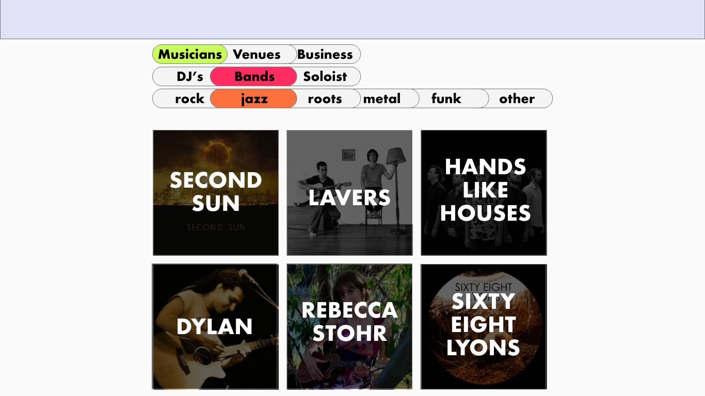

### Website redesign

#### Client: MusicACT

#### address: (www.musicact.com.au)

This Node.JS API and React app is a redesign of the current MusicACT website.

Its intention is to improve the UX of the site providing users a modern experience, and build upon previous features. The previous site was built in Drupal around 2012 and has limited updating (save for blog posts around 3 times a year), in addition to the blog the other main feature is a directory that allows musicians, venues and businesses create a profile that listed on the site. Minor features include a members sign up, email confirmation, admin rights (including editing, deleting profiles, banning users), password recovery, JWT tokens, document downloads.


**Due  to time restrictions the assignment was scoped to focus on the directory, meaning member login, profile creation, and viewing profiles**
_____________

### Significant Packages

#### Front-end

* React
* [React Router](https://reacttraining.com/react-router/)
* Passport
* [react-player](https://www.npmjs.com/package/react-player)
* [cloudinary-react](https://github.com/cloudinary/cloudinary-react)

#### Back-end

- [validator](https://github.com/chriso/validator.js)
- express
- passport
- jsonwebtoken
- mongoose


* [validator](https://github.com/chriso/validator.js)

#### Package Notes

[react-player](https://www.npmjs.com/package/react-player)

* works for youtube soundcloud and more and has a number of options.
* For **soundcloud** playlists are not supported
* We encounted a issue with ReactRouter as the pages could not be refreshed , the solution was to use HashRouter insteat of BrowserRouter.

---

### Client Interviews
10th Jan 2018
Skype Interviews
_This interview was to formally start the project and for us to get a understanding of the most important elements of the site_
#### Development

###### Q] How does admin access work?
###### A]
"I will provide you with a admin username and password to that you can see the current access, really theres a lot of stuff we don't use in there."
###### Q] How does member access work?
###### A]
"You will be able to see what the member sees with the admin access, its similar just obvious much more limited."
###### Q] How does automatic emails access work?
###### A]
"I'm not sure actually.. we use mail chimp to send our emails to the members."

###### Q] What database information is important to the organisation?
###### A]
"umm really just their email, name and type of  membership (musician, business, band). Obviously any other information we can use when presenting the organisation to other is valuable"

#### Style
_We provided a list of potentially similar sites as examples of features and styles_
###### Q] Not being graphic designers, are there any site or styles that jumped out at you that we could use to inspire the look and feel of this site?
###### A]
"really happy to let you take creative control with that and just do what you feel " - ( _hmmm not the answer we wanted_ )

#### Purpose
_We needed to find the real reasons for the site, who will be using it and why_
###### Q] Who is the most important user?
###### A]
Well there could be a few... Our goal is to represent the music industry as a lobbying body. But for now we want to use the site to bring in more members, these are going to be primarily musicians.
###### Q] Whats your call to action aka the goal?
###### A]
There are few main parts, which are the blog, profiles (the directory), committee page, and tweets (which is the most active.) We'd love a music playlist too!
###### Q] Where are you most active? social media (where), emails, print etc
###### A]
Twitter, followed by facebook, and then our blog articles.
###### Q] What else is important for the site
###### A]
We need to show off the sponsors, if you could somehow create a box on the homepage that cycled through the sponsors logos that would be amazing!

###### _Great thanks for your time_

#### Our Conclusions
We determined that the site had two main features, the blog and the directory. However the directory was the most important feature due to its uniqueness in the region, it's potential in bringing in new members and the under use of the blog.
For style we were given very little to go off.
Backend and database design seemed to be of less importance then we predicted and benefits of the Drupal backend were going mostly unused.
_____


---

### Inspiration

(http://www.musicvictoria.com.au/)
(http://www.musicnsw.com/)
(http://theoperatives.com.au/artist/ (for artist profiles))
(https://bandcamp.com/ (search limiting))
(https://warp.net/ (blog page))

_____________
### User Journeys


_This shows the journey of signing up and creating a profile for the directory_
### Wireframes

_This shows the mock for the directory as a desktop view. as the screen shrinks to mobile the rows of reduce to 2 then 1_

_This mock for the musican profile allows for the basics for presenting a professional artist_


---

### Getting started

1. Created API folder, `create-reate-app musicact`, documents folder
1. `git init`
1. `echo "**/node_modules" > .git`
1. `echo "**/.env" >> .git`
1. [set up preprocessor for sass](https://github.com/facebookincubator/create-react-app/blob/master/packages/react-scripts/template/README.md#adding-a-css-preprocessor-sass-less-etc)

### ERD

_The ERD was created on DB Design, although it contains a rough design for the whole site this assignments only focuses on the coloured collections._
### API
Our api has a number of routes and authentication
- POST new user
- PUT user
- DELETE user
- POST new profile
- PUT profile
- DELETE profile
- GET Profile by id
- GET all profiles

The Design found complications due to the breaking the profile information in to 4 seperate sections of ;
- contact details
- socialMedia Links
- Multimedia Links
- bio information

### Layout End-to-end
Our React front-end contains 38 components, below is a simplified diagram of the layout.


### Homepage

### Blog

followed a tutorial at (https://buttercms.com/react-blog-engine/) using **buttercms**

### Form Creates

* [cloudinary uploading ](https://css-tricks.com/image-upload-manipulation-react/)
* To create a positive user experience when creating a profile (before saving to data base), we need to consider the user journey. It may include spending time drafting a perfect biography, carefully selecting the right profile image and leaving the computer on many occasions. We can save the JSON to state and use that data to create the profile live in front of the user, however if they refresh the page all their changes will be lost. Therefore we also will need to save the profiles state to the browsers localStorage, this way it will be stored safely before calling the API to save to the database.
  [localStorage introduction guide](https://alligator.io/js/introduction-localstorage-sessionstorage/)

```js
localStorage.setItem('profile', JSON.stringify(this.state.createProfile)); //sets the profile
let profile = JSON.parse(localStorage.getItem('profile')); // retrieves profile
localStorage.clear(); //clears profile
```

### Profiles

* the JSON data holds line breaks as \n and did not import properly, so we needed to add a .replace(/\n/g, '<br />') method. **correction**( This turned out to not the right approach _instead_ simple css `white-space: pre-line;` does the same thing to better effect.)


### Bugs and Fixes

Cloudninary uploading is done simply without any security.

### Compatibility and Legacy browsers

* **CSS GRIDS** (https://caniuse.com/#feat=css-grid)
  CSS is a new major addition to the CSS language and 84.96% of browser use in Australia have _full_ support of the feature. From the remaining browsers without support, most cases are un-updated phone browsers ( <= Safari 10.2 for iOS ), and from IE that has partial support with prefix.
  There are certain [tactics to creating a fall back for grids](https://rachelandrew.co.uk/archives/2017/07/04/is-it-really-safe-to-start-using-css-grid-layout/) for the minority of older unsupported. Including proving the user the a differently styled layout which such as a the mobile view layout.

* **pointer-events: none;**
  This feature works on all browsers, above IE 10. For this site there will be some aesthetic for those small number of users, but will provide no major functional problems.

---

### Deployment

#### Netlify

Deployment has a few issues,

1. the CSS was not compiling properly on the home page due to foreign code copy and pasted form an online example.
1. The site appears to of deploy on netlify, however the link returns a _Page Not Found_ at (https://music-act.netlify.com/)

#### Heroku

Heroku deployment

1.set up config


-dev.js
module.exports = {
MONGO_URI:'mongodb://<db:user>:<db:password>:@ds111478.mlab.com:11478/app-name’
}

-key.js
if (process.env.NODE_ENV === 'production') {
module.exports = require('./prod');
}else{
module.exports =require('./dev');
}

-prod.js
module.exports = {
MONGO_URI: process.env.MONGO_URI
}

2.add .gitignore to dev.js

3.modify server.js

-server.js

```
// heroku env handring the ReactRoutes and NormalRoutes
if (process.env.NODE_ENV == 'production') {
  //Express will serve up production assets
  app.use(express.static('Client/build'));
  //Express will serve up the index.html
  const path = require('path');
  app.get('*', (req, res) => {
    res.sendFile(path.resolve(__dirname, 'Client', 'build', 'index.html'));
  });
}

// setup env running on heroku
const port = process.env.PORT || 5000;
app.listen(port, () => {
  console.log(`started on port ${port}`);
});
```

4.add package.json (!server side not client side)

-add engines

```
"engines": {
    "node": "9.2.0",
    "npm": "5.5.1"
  }
```

-add script

```
  "scripts": {
    "start": "node server",
    "heroku-postbuild":
      "NPM_CONFIG_PRODUCTION=false npm install --prefix Client && npm run build --prefix Client },

note: Client is the your client side folder name
```

5.create heroku app and push

heroku login
heroku create “NAMEOFAPP”
heroku git:remote -a “NAMEOFAPP”
git add .
git commit
git push heroku master

6.add config key to heroku

Top >> Settting >> configkey

